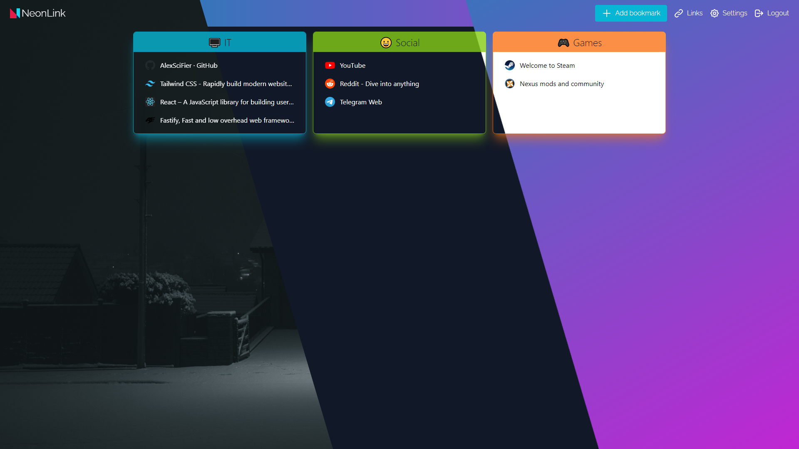

<p align="center">
  
</p>

## Overview

- [Introduction](#introduction)
- [Features](#features)
- [Screenshots](#screenshots)
- [Installation](#installation)
- [Development](#development)

## Introduction

NeonLink is a simple and open-source self-hosted bookmark service. It is lightweight, uses minimal dependencies, and is easy to install via Docker. Due to the low system requirements, this application is ideal for deployment on the RaspberryPI.

## Features

- Tags
- Search
- Auto icon, title, description
- Customizable background
- Lightweight
- Private
- Dashboard

## Installation

### With Docker

[DockerHub](https://hub.docker.com/r/alexscifier/neonlink)

You can easily install an application using Docker. The images are also optimized for RaspberryPi.

**First, create an empty `bookmarks.sqlite` file in a convenient place for you.**

Then run the command which will install the Docker container.

```sh
docker run -p {80}:3333 -v {/path/to/bookmarks.sqlite}:/app/db/bookmarks.sqlite -v {/path/to/backgroundimages}:/app/public/static/media/background alexscifier/neonlink:latest
```

- Replace {80} with any port you like.
- Replace {/path/to/bookmarks.sqlite} with the absolute path to the `bookmarks.sqlite` file you created earlier.
- Replace {/path/to/backgroundimages} with the path to folder with background images

Or you can install with `doker-compose.yml` file

```sh
#clone repo
git clone https://github.com/AlexSciFier/neonlink.git
cd neonlink

#edit doker-compose.yml and run docker compose
docker-compose up -d
```

## Development

This project is open source, so you can change it or contribute. The application consists of two parts. The frontend is based on the [React](https://reactjs.org/) framework. The server part is based on the [Fastify](https://www.fastify.io/) framework. [Sqlite](https://www.sqlite.org/index.html) is used as a data base and its implementation for Nodejs is [better-sqlite3](https://github.com/WiseLibs/better-sqlite3).

This project requires Nodejs and npm.

For Windows development, it is recommended to use git bash.

### Setup

```sh
#clone project
git clone https://github.com/AlexSciFier/neonlink.git
cd neonlink

# run once to install dependencies
npm run dev-init

#run dev server
npm run dev-start
```

## Build

To build your own docker container run in root folder

```sh
# build for amd64 architecture
docker build --platform linux/amd64 --tag alexscifier/neonlink:latest .
# build for ARM v7 architecture (Raspberry Pi)
docker build --platform linux/arm/v7 --tag alexscifier/neonlink:latest-armv7 .
```

## Screenshots




